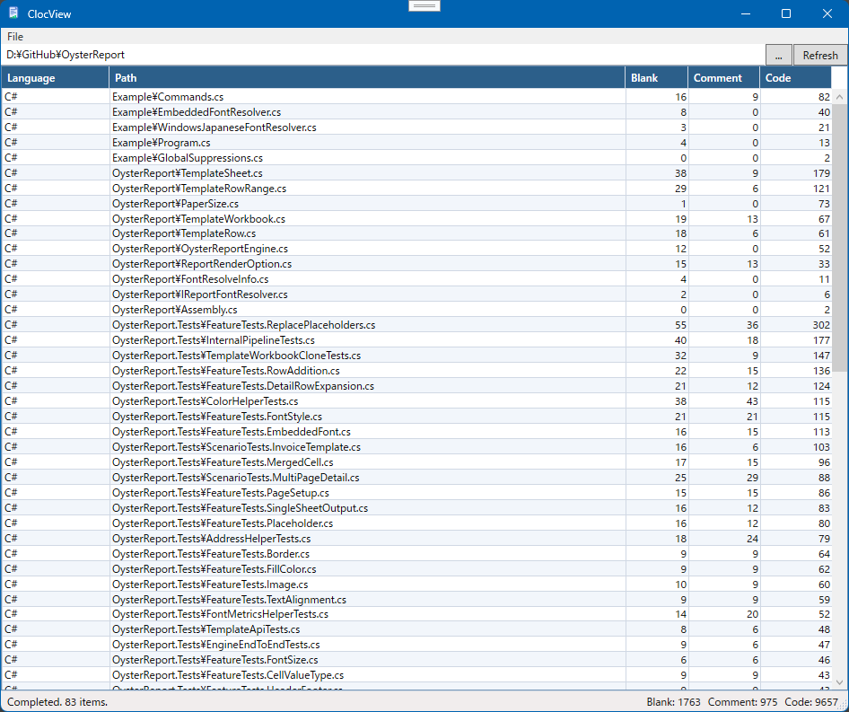

# cloc-view

Windows desktop application that displays [cloc](https://github.com/AlDanial/cloc) results in grid.



## Configuration (`appsettings.json`)

Customize behavior via `appsettings.json` located in the same folder as the executable.

```json
{
  "Cloc": {
    "ExecutablePath": "",
    "Option": {
      "ByFile": true,
      "IncludeLang": "C#,XAML,Razor,SQL,JavaScript,CSS",
      "ExcludeDir": "lib,Sandbox",
      "ExcludeExt": "min.js,min.css",
      "ExcludeContent": "auto-generated",
      "ExcludeSegmentPrefix": "__"
    }
  }
}
```

| Key | Default | Description |
|-----|---------|-------------|
| `Cloc.ExecutablePath` | `""` | Path to the cloc executable. Searches PATH if empty. |
| `Cloc.Option.ByFile` | `true` | Passes `--by-file` to cloc (per-file breakdown) |
| `Cloc.Option.IncludeLang` | — | Comma-separated language list passed to `--include-lang` |
| `Cloc.Option.ExcludeDir` | — | Comma-separated directory names passed to `--exclude-dir` |
| `Cloc.Option.ExcludeExt` | — | Comma-separated extensions passed to `--exclude-ext` |
| `Cloc.Option.ExcludeContent` | — | Regex passed to `--exclude-content` |
| `Cloc.Option.ExcludePrefix` | — | Comma-separated prefixes. Entries whose path contains a segment starting with any of these prefixes are excluded from results |
